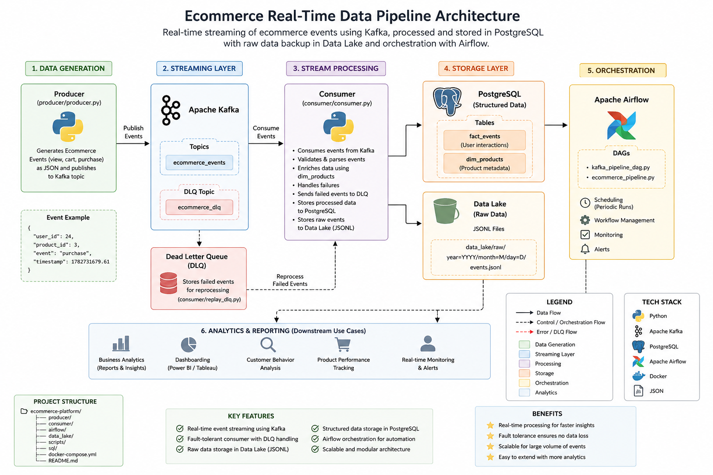

# 🚀 Real-Time AI-Driven Ecommerce Data Pipeline

## 👩‍💻 About This Project

I am Bushra Tazyeen, an AI Engineer and Data Scientist with experience in machine learning, computer vision, backend development, and full-stack AI systems.

This project demonstrates an end-to-end **real-time data pipeline** for an ecommerce platform, combining event streaming, data processing, workflow orchestration, structured storage, and cloud-native deployment concepts.

The system was initially developed using **Docker Compose** and later migrated to **Kubernetes** for local cloud-native deployment and orchestration.

---

## 📌 Project Overview

The pipeline processes ecommerce user events such as:

* Product views
* Add-to-cart actions
* Purchases

Events are generated by a Python producer and streamed through Apache Kafka. A consumer processes and enriches the events before storing them in PostgreSQL and a data lake.

Apache Airflow is used to orchestrate analytics workflows.

### High-Level Flow

```text
Producer
   ↓
Apache Kafka
   ↓
Consumer
   ├──→ PostgreSQL
   └──→ Data Lake
          ↓
      Apache Airflow
          ↓
       Analytics
```

The project demonstrates how real-time event processing and batch-style analytics workflows can work together in a data-intensive application.

---

## 🧱 Architecture



### Core Components

* **Producer** — Generates ecommerce events continuously
* **Kafka** — Handles real-time event streaming
* **Consumer** — Processes, validates, and enriches events
* **PostgreSQL** — Stores structured event and product data
* **Data Lake** — Persists raw event history in JSONL format
* **Airflow** — Orchestrates analytics workflows
* **Docker** — Containerizes application components
* **Kubernetes** — Orchestrates the containerized services

---

## ☸️ Kubernetes Deployment

The original Docker Compose implementation was subsequently migrated to **Kubernetes** to gain practical experience with container orchestration and cloud-native application deployment.

The Kubernetes deployment includes:

* PostgreSQL Deployment and Service
* PostgreSQL PersistentVolumeClaim
* ZooKeeper Deployment and Service
* Kafka Deployment and Service
* Ecommerce Consumer Deployment
* Consumer PersistentVolumeClaim
* Producer Deployment
* Airflow Deployment
* Airflow DAG ConfigMap
* Kubernetes Secrets for database configuration
* Resource requests and limits
* Container liveness probing
* Kubernetes service discovery

### Kubernetes Architecture

```text
                    Kubernetes Cluster
                           │
          ┌────────────────┼────────────────┐
          │                │                │
       Producer          Kafka          PostgreSQL
          │                │                │
          │          ZooKeeper             │
          │                │                │
          └──────────→ Consumer ───────────┘
                         │
                         ↓
                    Data Lake PVC
                         
                         │
                         ↓
                      Airflow
                         │
                         ↓
                     Analytics
```

The Kubernetes deployment was developed and tested locally using **Docker Desktop Kubernetes**.

> This project is a learning and portfolio implementation of Kubernetes-based orchestration rather than a production cloud deployment.

---

## ⚙️ Tech Stack

### Application & Data

* Python
* Apache Kafka
* PostgreSQL
* Apache Airflow
* SQL
* JSONL

### Containerization & Infrastructure

* Docker
* Docker Compose
* Kubernetes
* Persistent Volumes / PVCs
* Kubernetes Services
* Kubernetes Secrets
* ConfigMaps
* Resource Requests & Limits
* Liveness Probes

---

## 📂 Project Structure

```text
ecommerce-platform/
│
├── producer/                 # Ecommerce event producer
│   ├── producer.py
│   └── Dockerfile
│
├── consumer/                 # Kafka stream processing
│   ├── consumer.py
│   ├── Dockerfile
│   └── requirements.txt
│
├── airflow/                  # Airflow orchestration
│   ├── dags/
│   └── Dockerfile
│
├── k8s/                      # Kubernetes manifests
│   ├── airflow.yaml
│   ├── airflow-dags-configmap.yaml
│   ├── consumer.yaml
│   ├── consumer-pvc.yaml
│   ├── kafka.yaml
│   ├── postgres.yaml
│   ├── producer.yaml
│   └── zookeeper.yaml
│
├── data_lake/                # Raw event storage
├── sql/                      # Database schema and SQL
├── scripts/                  # Analytics and utilities
├── docker-compose.yml        # Docker Compose deployment
└── analytics_test.py         # Analytics testing
```

---

## 🔥 Key Features

### Real-Time Streaming

* Continuous ecommerce event generation
* Kafka-based event streaming
* Multiple Kafka partitions
* Consumer group processing
* Event validation and enrichment

### Fault Handling

* Failed-event handling
* Dead Letter Queue (DLQ) support
* Persistent raw event storage
* PostgreSQL connection pooling

### Data Engineering

* Fact and dimension data modeling
* Structured PostgreSQL storage
* Raw JSONL data lake storage
* SQL-based analytics
* Airflow workflow orchestration

### Kubernetes

* Containerized services deployed as Kubernetes workloads
* Kubernetes Services for internal communication
* Persistent storage using PVCs
* Secrets for database configuration
* Resource requests and limits
* Liveness probes
* Kubernetes-based service discovery

---

## 🗄️ Data Model

### Fact Table

`fact_events`

* `user_id`
* `product_id`
* `event_type`
* `event_time`

### Dimension Table

`dim_products`

* `product_id`
* `product_name`
* `category`
* `price`

Analytics tables are generated from processed event data using SQL workflows orchestrated through Airflow.

---

## 🧪 How to Run

### Option 1 — Docker Compose

Start the original containerized environment:

```bash
docker-compose up -d
```

The Docker Compose configuration provides the original development environment for the pipeline.

### Option 2 — Kubernetes

Create the namespace:

```bash
kubectl create namespace ecommerce
```

Apply the Kubernetes manifests:

```bash
kubectl apply -f k8s/
```

Check the deployed workloads:

```bash
kubectl get pods -n ecommerce
```

Check the Kubernetes services:

```bash
kubectl get services -n ecommerce
```

The Kubernetes configuration is intended for **local development and learning**.

---

## 📊 Example Event

```json
{
  "user_id": 24,
  "product_id": 3,
  "event": "purchase",
  "timestamp": 1782731679.6130564
}
```

The processed event is stored in:

```text
PostgreSQL
    ↓
Structured analytics data

Data Lake
    ↓
Raw event history
```

---

## 🧠 What This Project Demonstrates

This project demonstrates practical experience with:

* Designing real-time streaming pipelines
* Apache Kafka producers and consumers
* Event processing and enrichment
* PostgreSQL data modeling
* ETL and analytics workflows
* Airflow orchestration
* Docker containerization
* Kubernetes application deployment
* Persistent storage in Kubernetes
* Kubernetes service discovery
* Configuration and secret management
* Debugging distributed containerized applications

It also connects with my broader experience in:

* Machine learning pipelines
* FastAPI backend services
* Computer vision and AI systems
* Full-stack application development
* ML model deployment

---

## 📈 Future Improvements

Potential future improvements include:

* Deploying the system to AWS
* Adding CI/CD automation
* Adding monitoring with Prometheus and Grafana
* Introducing Kafka Schema Registry
* Adding distributed processing with Apache Spark
* Adding a BI dashboard using Power BI or Apache Superset

These are potential extensions rather than requirements for the current implementation.

---

## ⚠️ Project Scope

This is a **portfolio and learning project** designed to demonstrate practical experience with real-time data engineering, containerization, and Kubernetes orchestration.

The Kubernetes environment currently runs locally and is not intended to represent a production deployment.

---

## 👩‍💻 Author

**Bushra Tazyeen**

AI Engineer | Data Scientist | Machine Learning & Full-Stack Systems

**Technologies:** Python • SQL • FastAPI • React/Next.js • Kafka • PostgreSQL • Airflow • Docker • Kubernetes • ML Systems
