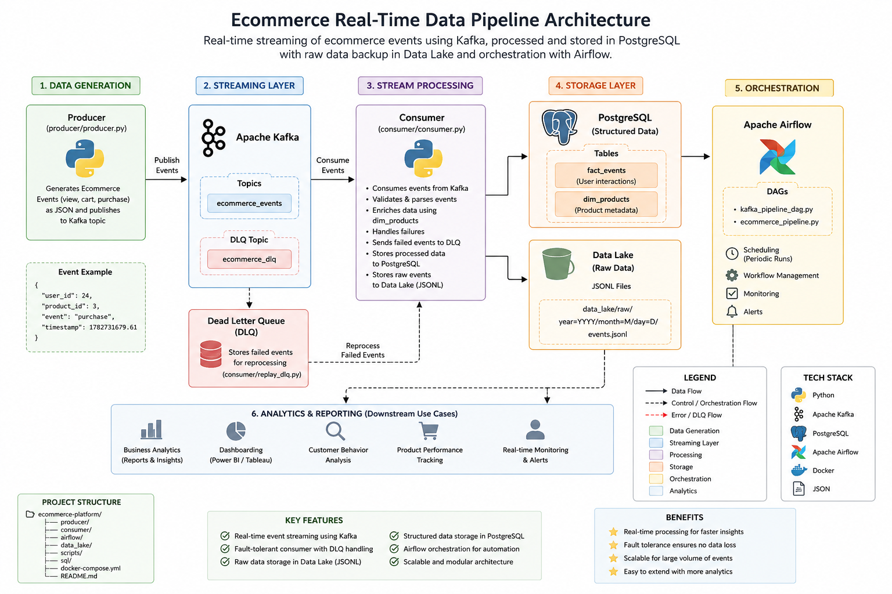

# 🚀 Real-Time AI-Driven Ecommerce Data Pipeline (Kafka + Airflow + PostgreSQL)

## 👩‍💻 About This Project

I am Bushra Tazyeen, an AI Engineer and Data Scientist with experience in machine learning, computer vision, and full-stack system development.

This project represents my focus on building **production-style data engineering systems** that connect real-time streaming, machine learning concepts, and scalable backend architecture.

It simulates how modern AI-powered ecommerce platforms process user behavior data in real time.

---

## 📌 Project Overview

This system processes ecommerce user events such as:
- Product views
- Add to cart actions
- Purchases

It demonstrates an end-to-end data pipeline using Kafka for streaming, PostgreSQL for structured storage, and a data lake for raw event persistence.

The goal is to simulate real-world production data infrastructure used in AI-driven companies.

---


## 🧱 System Architecture


Producer → Kafka → Consumer → Data Lake + PostgreSQL → Airflow


- Kafka handles real-time event streaming
- Consumer processes and enriches data
- PostgreSQL stores structured analytics data
- Data Lake stores raw historical events
- Airflow orchestrates workflows (pipeline automation)

---

## ⚙️ Tech Stack

- Python
- Apache Kafka
- PostgreSQL
- Apache Airflow
- Docker & Docker Compose
- SQL (Data Modeling)
- JSONL Data Lake Storage

---

## 📂 Project Structure


ecommerce-platform/
│
├── producer/ # Generates ecommerce events
├── consumer/ # Stream processing + enrichment
├── airflow/ # DAG orchestration
├── data_lake/ # Raw event storage (JSONL format)
├── sql/ # Database schema (fact + dimension model)
├── scripts/ # Data generation + utilities
└── docker-compose.yml # Infrastructure setup


---

## 🔥 Key Features

- Real-time event streaming using Kafka
- Fault-tolerant consumer design
- Dead Letter Queue (DLQ) for failed events
- Data lake storage for raw event tracking
- Dimensional data modeling (fact_events, dim_products)
- Connection pooling for PostgreSQL optimization
- Airflow orchestration for pipeline automation
- Production-style modular architecture

---

## 🗄️ Data Model

### Fact Table
- `fact_events`
  - user_id
  - product_id
  - event_type
  - event_time

### Dimension Table
- `dim_products`
  - product_id
  - product_name
  - category
  - price

---

## 🧪 How to Run

### 1. Start Infrastructure
```bash
docker-compose up -d
2. Create Database Tables
psql -U airflow -d airflow -f sql/create_tables.sql
3. Start Consumer
python consumer/consumer.py
4. Start Producer
python producer/producer.py
📊 Example Event Flow
{
  "user_id": 24,
  "product_id": 3,
  "event": "purchase",
  "timestamp": 1782731679.6130564
}

Processed and stored into:

PostgreSQL (structured analytics)
Data Lake (raw event history)
🧠 What This Project Demonstrates

This project reflects my ability to:

Design real-time streaming systems (Kafka)
Build ETL-style data pipelines
Work with structured + unstructured data
Apply data modeling concepts (fact/dimension schema)
Design production-style backend architecture
Integrate data engineering with AI/ML thinking

It connects directly with my experience in:

Machine learning pipelines
Backend systems (FastAPI)
Data processing workflows
Computer vision + AI systems
⚠️ Notes

This project is part of my continuous learning journey toward building scalable, production-grade AI and data systems.

📈 Future Improvements
Add Spark-based distributed processing
Add monitoring (Prometheus + Grafana)
Add BI dashboard (Power BI / Superset)
Deploy on cloud (AWS/GCP)
Add schema registry for Kafka events
👩‍💻 Author

Bushra Tazyeen
AI Engineer | Data Scientist | Machine Learning & Full-Stack Systems

Python • SQL • FastAPI • React/Next.js • ML Systems